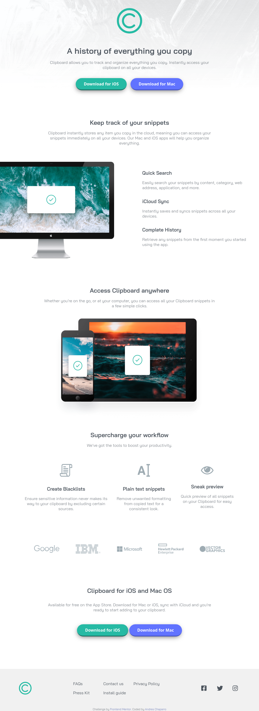
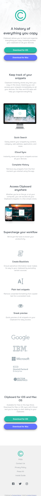

# Frontend Mentor - Clipboard landing page solution

This is a solution to the [Clipboard landing page challenge on Frontend Mentor](https://www.frontendmentor.io/challenges/clipboard-landing-page-5cc9bccd6c4c91111378ecb9). Frontend Mentor challenges help you improve your coding skills by building realistic projects. 

## Table of contents

- [Overview](#overview)
  - [The challenge](#the-challenge)
  - [Screenshot](#screenshot)
  - [Links](#links)
- [My process](#my-process)
  - [Built with](#built-with)
  - [What I learned](#what-i-learned)
  - [Continued development](#continued-development)
  - [Useful resources](#useful-resources)
- [Author](#author)
- [Acknowledgments](#acknowledgments)

## Overview

### The challenge

Users should be able to:

- View the optimal layout for the site depending on their device's screen size
- See hover states for all interactive elements on the page

### Screenshot

### Links

- Solution URL: [Frontendmentor Site](https://www.frontendmentor.io/solutions/clipboard-landing-page-SYxIIjvpRg/)

## My process

### Built with

- Semantic HTML5 markup
- CSS custom properties
- Flexbox
- CSS Grid
- Mobile-first workflow

### What I learned

I learned to use fontawesome icons.
I learned to use position to move an image slightly on the page.

### Continued development

It was the first time I implemented mobile-first workflow. It wasy very interesting.

### Useful resources
I received valuable comment from frontendmentor users. 
I also checked other people's code, and learned quite a bit. 

## Author

- Website - [Andres Chaparro](https://t0ntin.github.io/clipboard-landing-page-master/)
- Frontend Mentor - [@t0ntin](https://www.frontendmentor.io/profile/t0ntin)
- Twitter - [@t0ntinx](https://www.twitter.com/t0ntinx)

## Acknowledgments

Thanks to the people at frontendmentor who made comments on my work.

